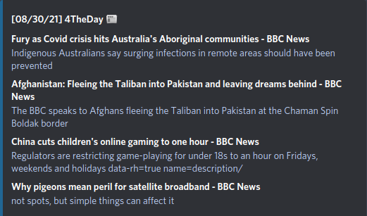

## News web scraping

### Web Scraping with python selecting four news items to keep informed for the day. 

---

## Considerations
* You can use `import nws`
* You have to install the [requirements](#requirements)
* The news are from bbc
* I do not own any rights to the site, news and images presented, nor am I responsible for any changes made later by someone else

---

## Requirements

* requests
* BeautifulSoup

---

## Credits
* Site that are sources for the news etc: https://www.bbc.com/

---

Made by [André V.](https://github.com/Dedsd)